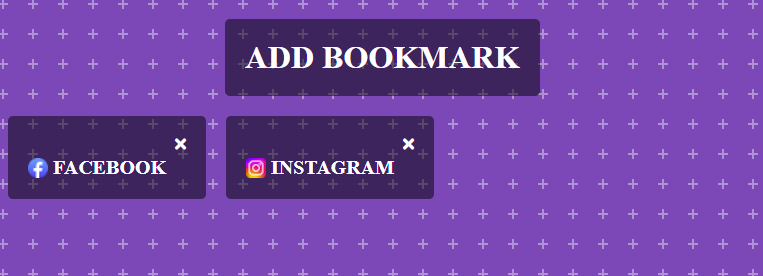

[bookmarks-link]: https://amssdias.github.io/bookmark/

# Bookmarks

Welcome to the Bookmarks page, a simple yet powerful tool to keep your favorite websites organized and accessible. Built with HTML5, CSS3, and JavaScript, this project offers a user-friendly interface where you can easily save, view, and manage links to your most-visited websites.

## Live Demo

Visit the [Bookmarks][bookmarks-link] to start saving your favorite websites. Try it out for yourself and see how easy it is to keep your online resources organized!
